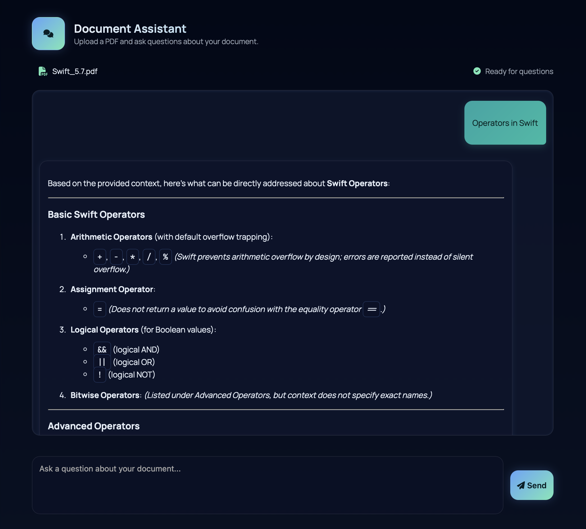

# Simple PDF RAG

## Installation
You need to install the better Python package manager **[uv](https://docs.astral.sh/uv/getting-started/installation/)** to run this app.
You also need to install **[Ollama](https://ollama.com/download)**.

### Tested Versions
- Ollama: v0.1.3.4 (other versions may work but have not been tested)
- Python: 3.13

### Disclaimer
This project is provided as-is, without warranty. Use at your own risk.

---

## Commands After Installation
- **`ollama run ministral-3:3b`** (LLM for offline capability)
- **`uv python install 3.13`** (required Python version)
- **`uv init`**
- **`uv venv --python 3.13`**
- **`uv pip install -r requirements.txt`**
- **`uv run main.py`**

---

## Hints
- After running **`uv run main.py`**, navigate to [http://localhost:5000/](http://localhost:5000/) in your web browser.
- You can now upload a PDF file and ask your questions.
- To stop the app, press **`[CTRL] + [C]`** in the console.
- To restart, simply run **`uv run main.py`** again.

---

## Additional Information

### License Information
This project uses **[Ollama](https://ollama.com/)** (License: [MIT](https://github.com/ollama/ollama/blob/main/LICENSE)) and **[uv](https://docs.astral.sh/uv/)** (License: [Apache 2.0](https://github.com/astral-sh/uv/blob/main/LICENSE)). Please review the respective license terms for each tool.

### Privacy Notice
All data and requests are processed locally on your machine. No data is transmitted to external servers.

### Privacy Notice for External Resources
This project uses the following external resources via CDN:
- **Google Fonts** (`Inter`, `JetBrains Mono`, `Manrope`)
- **Font Awesome** (icons)

**Data Privacy:**
These resources are loaded from third-party servers, which may collect and process your IP address and other metadata. If you want to avoid this, you can:
- **Download the fonts and icons locally** and reference them in your HTML/CSS.
- Use a **local development environment** with internet access disabled for these resources.

**How to Use Local Fonts/Icons:**
1. Download the font files from [Google Fonts](https://fonts.google.com/) and the Font Awesome CSS from [Font Awesome](https://fontawesome.com/).
2. Place them in your project’s `static` folder.
3. Update the HTML to reference the local files instead of the CDN.
